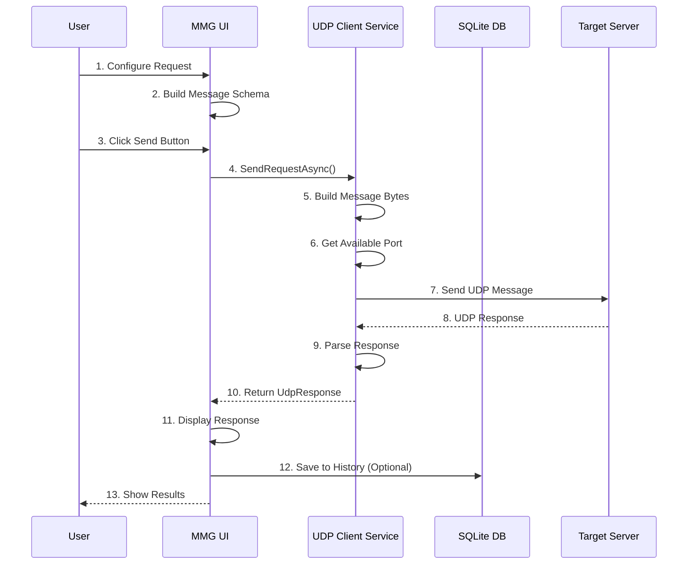
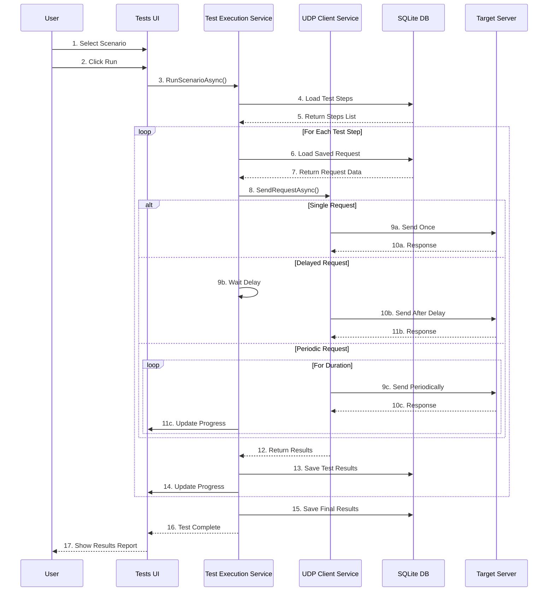
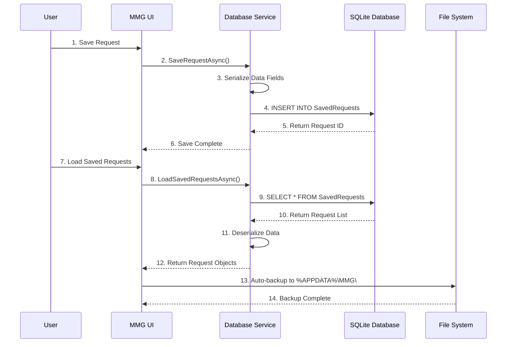

# MMG (Message & Message Generator)

## 프로그램 개요

MMG는 UDP 프로토콜 기반의 네트워크 메시지 생성 및 테스트를 위한 Windows 데스크톱 애플리케이션입니다. 이 소프트웨어는 개발자와 네트워크 엔지니어가 UDP 통신 프로토콜을 쉽게 테스트하고 검증할 수 있도록 설계된 전문적인 도구입니다.

## 프로그램 특징

### 🚀 혁신적인 기능
- **비주얼 메시지 디자이너**: GUI 기반의 직관적인 UDP 메시지 구성
- **실시간 응답 분석**: 수신된 데이터의 즉석 파싱 및 시각화
- **스마트 포트 관리**: 자동 포트 할당으로 충돌 방지
- **멀티 시나리오 테스트**: 복합적인 테스트 케이스 자동 실행

### 🎯 개발자 친화적 설계
- **Zero Configuration**: 설치 후 즉시 사용 가능
- **Hot Reload**: 실시간 메시지 수정 및 재전송
- **Export/Import**: 요청 및 시나리오 공유 기능
- **History Tracking**: 모든 테스트 이력 자동 저장

### 🔧 전문가급 도구
- **Hex/Binary 지원**: 다양한 데이터 형식 입력
- **Template System**: 자주 사용하는 패턴 저장
- **Batch Testing**: 대량 테스트 자동화
- **Performance Monitor**: 응답 시간 및 성능 측정

### 🛡️ 안정성 & 보안
- **Error Recovery**: 네트워크 오류 자동 복구
- **Data Validation**: 입력 데이터 무결성 검증
- **Secure Storage**: 로컬 암호화 저장
- **Audit Trail**: 완전한 활동 로그

## 주요 기능

### 1. UDP 메시지 생성 및 전송
- 사용자 정의 헤더 및 페이로드 필드 구성
- 다양한 데이터 타입 지원 (Byte, UInt16, Int, UInt, Float, Padding)
- 실시간 UDP 메시지 전송 및 응답 수신
- IP 주소 및 포트 설정을 통한 다양한 네트워크 환경 지원

### 2. 메시지 스키마 관리
- 요청 메시지 스키마 생성 및 편집
- 응답 메시지 스키마 정의 및 파싱
- 메시지 구조의 시각적 편집 인터페이스

### 3. 요청 저장 및 관리
- 자주 사용하는 UDP 요청의 저장 및 재사용
- 폴더 구조를 통한 체계적인 요청 분류
- 저장된 요청의 이름 변경, 복사, 삭제 기능

### 4. 자동화된 테스트 시나리오
- 복수의 테스트 단계로 구성된 시나리오 생성
- 단일 요청, 지연 요청, 주기적 요청 등 다양한 테스트 패턴 지원
- 테스트 실행 결과의 실시간 모니터링
- 테스트 진행률 및 결과 리포트 제공

### 5. 데이터베이스 기반 저장소
- SQLite를 활용한 로컬 데이터 저장
- 요청, 시나리오, 테스트 결과의 영구 보존
- 데이터 무결성 및 안정성 보장

### 6. 직관적인 사용자 인터페이스
- WPF 기반의 현대적인 Windows UI
- 탭 기반 다중 작업 환경
- 실시간 데이터 수신 모니터링
- 사용자 친화적인 설정 및 구성 다이얼로그

## 기술 스펙

- **플랫폼**: Windows (.NET 8.0)
- **UI 프레임워크**: WPF (Windows Presentation Foundation)
- **데이터베이스**: SQLite
- **네트워크 프로토콜**: UDP (User Datagram Protocol)
- **프로그래밍 언어**: C#
- **아키텍처 패턴**: MVVM (Model-View-ViewModel)

## 시스템 요구사항

### 최소 요구사항
- **운영체제**: Windows 10 이상
- **프레임워크**: .NET 8.0 Runtime
- **메모리**: 512MB RAM
- **디스크 공간**: 100MB 여유 공간
- **네트워크**: UDP 통신이 가능한 네트워크 환경

### 권장 요구사항
- **운영체제**: Windows 11
- **메모리**: 2GB RAM 이상
- **디스크 공간**: 500MB 여유 공간
- **해상도**: 1920x1080 이상

## 설치 및 실행

### 1. 사전 요구사항 설치
- .NET 8.0 Runtime 설치 (Microsoft 공식 웹사이트에서 다운로드)

### 2. 애플리케이션 설치
- MMG.exe 파일을 원하는 디렉토리에 복사
- 첫 실행 시 필요한 데이터베이스 및 설정 파일 자동 생성

### 3. 실행
- MMG.exe 파일을 더블클릭하여 실행
- 또는 명령 프롬프트에서 실행 파일 경로로 이동 후 실행

## 빌드 및 배포

### 개발 환경 설정
1. Visual Studio 2022 또는 Visual Studio Code 설치
2. .NET 8.0 SDK 설치
3. 프로젝트 복제 또는 다운로드

### 릴리스 빌드 생성
```bash
# 단일 실행 파일로 빌드 (권장)
dotnet publish -c Release -r win-x64 --self-contained true /p:PublishSingleFile=true /p:IncludeAllContentForSelfExtract=true

# 출력 위치: bin\Release\net8.0-windows\win-x64\publish\MMG.exe
```

### 설치 파일 생성 (Inno Setup)

#### 사전 요구사항
1. [Inno Setup](https://jrsoftware.org/isinfo.php) 다운로드 및 설치

#### 설치 파일 빌드
```bash
# 배치 파일로 빌드 (Windows)
build-installer.bat

# 또는 PowerShell로 빌드
.\build-installer.ps1

# 출력 위치: installer\MMG-Setup-v1.0.0.exe
```

#### 수동 빌드 (Inno Setup 직접 사용)
1. Inno Setup을 설치합니다
2. `MMG-Setup.iss` 파일을 Inno Setup으로 엽니다
3. "Build" 메뉴에서 "Compile" 선택
4. `installer` 폴더에 설치 파일이 생성됩니다

### 빌드 옵션 설명
- `-c Release`: 릴리스 모드로 빌드
- `-r win-x64`: 64비트 Windows 대상
- `--self-contained true`: .NET Runtime 포함
- `/p:PublishSingleFile=true`: 단일 실행 파일 생성
- `/p:IncludeAllContentForSelfExtract=true`: 모든 콘텐츠 포함

**참고**: WPF 애플리케이션의 특성상 트리밍(`PublishTrimmed`)은 지원되지 않습니다.

## 사용 방법

### 1. 기본 UDP 메시지 전송

#### 단계 1: 요청 구성
1. 메인 화면에서 "API" 탭 선택
2. IP 주소 및 포트 번호 입력
3. 헤더 섹션에서 필요한 데이터 필드 추가
   - "Add Header" 버튼 클릭
   - 필드명, 데이터 타입, 값 설정
4. 페이로드 섹션에서 필요한 데이터 필드 추가
   - "Add Payload Field" 버튼 클릭
   - 필드 구성 완료

#### 단계 2: 응답 스키마 설정
1. "Response Schema" 탭 선택
2. 예상되는 응답 메시지 구조 정의
3. 헤더 및 페이로드 필드 추가

#### 단계 3: 메시지 전송
1. "Send" 버튼 클릭
2. 응답 패널에서 수신된 데이터 확인
3. Raw 데이터 및 파싱된 데이터 모두 제공

### 2. 요청 저장 및 재사용

#### 저장하기
1. 요청 구성 완료 후 "Save" 버튼 클릭
2. 요청명 및 설명 입력
3. 폴더 선택 (새 폴더 생성 가능)
4. 저장 완료

#### 불러오기
1. "Saved Requests" 패널에서 저장된 요청 선택
2. "Load" 버튼 클릭
3. 요청 정보가 자동으로 입력란에 로드

### 3. 테스트 시나리오 실행

#### 시나리오 생성
1. "Tests" 탭 선택
2. "New Scenario" 버튼 클릭
3. 시나리오명 및 설명 입력
4. 테스트 단계 추가:
   - 단일 요청: 저장된 요청을 한 번 실행
   - 지연 요청: 지정된 시간 후 요청 실행
   - 주기적 요청: 설정된 주기와 지속시간 동안 반복 실행

#### 시나리오 실행
1. 생성된 시나리오 선택
2. "Run" 버튼 클릭
3. 실행 진행률 및 결과 실시간 모니터링
4. 완료 후 상세 결과 리포트 확인

## 운용개념도 및 시퀀스 다이어그램

### 📊 시스템 아키텍처

```
┌─────────────────────────────────────────────────────────────┐
│                     MMG Application                        │
├─────────────────────────────────────────────────────────────┤
│  ┌─────────────┐  ┌─────────────┐  ┌─────────────┐        │
│  │   API Tab   │  │  Tests Tab  │  │ Settings    │        │
│  │             │  │             │  │             │        │
│  │ ┌─────────┐ │  │ ┌─────────┐ │  │ ┌─────────┐ │        │
│  │ │Request  │ │  │ │Scenario │ │  │ │Database │ │        │
│  │ │Builder  │ │  │ │Manager  │ │  │ │Config   │ │        │
│  │ └─────────┘ │  │ └─────────┘ │  │ └─────────┘ │        │
│  │             │  │             │  │             │        │
│  │ ┌─────────┐ │  │ ┌─────────┐ │  │             │        │
│  │ │Response │ │  │ │Test     │ │  │             │        │
│  │ │Parser   │ │  │ │Runner   │ │  │             │        │
│  │ └─────────┘ │  │ └─────────┘ │  │             │        │
│  └─────────────┘  └─────────────┘  └─────────────┘        │
├─────────────────────────────────────────────────────────────┤
│                   Core Services Layer                      │
│  ┌─────────────┐  ┌─────────────┐  ┌─────────────┐        │
│  │   UDP       │  │  Database   │  │    Test     │        │
│  │  Client     │  │   Service   │  │ Execution   │        │
│  │  Service    │  │             │  │  Service    │        │
│  └─────────────┘  └─────────────┘  └─────────────┘        │
├─────────────────────────────────────────────────────────────┤
│                    Data Layer                              │
│  ┌─────────────┐  ┌─────────────┐  ┌─────────────┐        │
│  │   SQLite    │  │   Saved     │  │    Test     │        │
│  │  Database   │  │  Requests   │  │  Results    │        │
│  │             │  │             │  │             │        │
│  └─────────────┘  └─────────────┘  └─────────────┘        │
└─────────────────────────────────────────────────────────────┘
                            │
                            ▼
┌─────────────────────────────────────────────────────────────┐
│                 Network Layer (UDP)                        │
└─────────────────────────────────────────────────────────────┘
                            │
                            ▼
┌─────────────────────────────────────────────────────────────┐
│              Target Server / Device                        │
└─────────────────────────────────────────────────────────────┘
```

### 🔄 단일 UDP 요청 시퀀스 다이어그램



### 🎯 테스트 시나리오 실행 시퀀스 다이어그램



### 💾 데이터 저장 및 관리 시퀀스



## 파일 구조

```
MMG/
├── MMG.exe                     # 메인 실행 파일
├── Libraries/                  # 외부 라이브러리
│   ├── x64/SQLite.Interop.dll
│   ├── x86/SQLite.Interop.dll
│   └── System.Data.SQLite.dll
├── Resources/                  # UI 리소스
│   ├── AppIcon.ico
│   ├── Colors.xaml
│   ├── FontSize.xaml
│   ├── Styles.xaml
│   └── TestStyles.xaml
└── %APPDATA%/MMG/             # 사용자 데이터 폴더
    └── MMG.db                 # SQLite 데이터베이스
```

## 데이터 관리

### 데이터 저장 위치
- 사용자 데이터: `%APPDATA%\MMG\MMG.db`
- 설정 파일: 애플리케이션과 동일한 디렉토리

### 백업 권장사항
- 정기적으로 MMG.db 파일 백업
- 중요한 테스트 시나리오 및 요청은 별도 백업 유지

## 문제 해결

### 일반적인 문제

#### 1. 애플리케이션이 시작되지 않음
- .NET 8.0 Runtime 설치 여부 확인
- Windows 버전 호환성 확인
- 관리자 권한으로 실행 시도

#### 2. UDP 통신 실패
- 방화벽 설정 확인
- 대상 서버의 가용성 확인
- 네트워크 연결 상태 점검
- 포트 번호 중복 사용 여부 확인

#### 3. 데이터베이스 오류
- MMG.db 파일 권한 확인
- 디스크 공간 부족 여부 확인
- 데이터베이스 파일 손상 시 백업 파일로 복원

### 로그 및 디버깅
- 애플리케이션 오류 시 Windows 이벤트 로그 확인
- 네트워크 통신 문제 시 Wireshark 등의 패킷 분석 도구 활용

## 라이선스 및 저작권

**저작권**: © 2025 [저작자명]
**라이선스**: [라이선스 종류]

본 소프트웨어는 저작권법의 보호를 받으며, 무단 복제, 배포, 수정을 금지합니다.

## 개발 정보

- **개발 언어**: C# (.NET 8.0)
- **개발 환경**: Visual Studio 2022
- **버전 관리**: Git
- **빌드 도구**: MSBuild

## 버전 히스토리

### v1.0.0 (2025-10-22)
- 초기 릴리스
- UDP 메시지 생성 및 전송 기능
- 요청 저장 및 관리 기능
- 테스트 시나리오 실행 기능
- SQLite 기반 데이터 저장

## 연락처 및 지원

기술 지원이나 문의사항이 있으시면 다음 정보를 참조하시기 바랍니다:

- **개발자**: 금교석 선임
- **이메일**: Kyoseok.Keum@lignex1.com


---

**면책조항**: 본 소프트웨어는 개발 목적으로 제작되었습니다. 상용 환경에서의 사용 시 충분한 테스트를 거쳐 사용하시기 바랍니다. 본 소프트웨어 사용으로 인해 발생하는 어떠한 손해에 대해서도 개발자는 책임을 지지 않습니다.